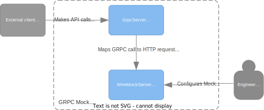

[](https://masterminds.github.io/stability/maintenance.html)
[](https://hub.docker.com/repository/docker/algosstile/grpc-wiremock/builds)
[](https://hub.docker.com/repository/docker/algosstile/grpc-wiremock/general)

# Обзор
Grpc-wiremock — это **сервер моков** для **GRPC** сервисов, реализованный как обёртка 

вокруг http-сервера [WireMock](http://wiremock.org)

## Как это работает

<p align="center">
  
</p>

*grpc-wiremock* запускает gRPC-сервер, сгенерированный на основе предоставленных proto-файлов, который конвертирует proto gRPC-запрос в JSON и перенаправляет его как POST-запрос на WireMock, затем конвертирует http-ответ обратно в gRPC proto-формат.
1. GRPC-сервер работает на `tcp://localhost:50000`
2. WireMock-сервер работает на `http://localhost:8888`

## Быстрое использование
1) Запустите
```posh
docker run -p 8888:8888 -p 50000:50000 -v $(pwd)/example/proto:/proto -v $(pwd)/example/wiremock:/wiremock adven27/grpc-wiremock 
```

2) Настройте мок
```posh
curl -X POST http://localhost:8888/__admin/mappings \
  -d '{
    "request": {
        "method": "POST",
        "url": "/BalanceService/getUserBalance",
        "headers": {"withAmount": {"matches": "\\d+\\.?\\d*"} },
        "bodyPatterns" : [ {
            "equalToJson" : { "userId": "1", "currency": "EUR" }
        } ]
    },
    "response": {
        "status": 200,
        "jsonBody": { 
            "balance": { 
                "amount": { "value": { "decimal" : "{{request.headers.withAmount}}" }, "value_present": true },
                "currency": { "value": "EUR", "value_present": true }
            } 
        }
    }
}'
```

3) Проверьте
```posh
grpcurl -H 'withAmount: 100.0' -plaintext -d '{"user_id": 1, "currency": "EUR"}' localhost:50000 api.wallet.BalanceService/getUserBalance
```

Должны получить ответ:
```json
{
  "balance": {
    "amount": {
      "value": {
        "decimal": "100.0"
      },
      "value_present": true
    },
    "currency": {
      "value": "EUR",
      "value_present": true
    }
  }
}
```
## Настройка моков

Stubbing should be done via [WireMock JSON API](http://wiremock.org/docs/stubbing/) 

### Error mapping

Default error (not `200 OK`) mapping is based on https://github.com/googleapis/googleapis/blob/master/google/rpc/code.proto :

| HTTP Status Code          | GRPC Status        | 
|---------------------------|:-------------------|
| 400 Bad Request           | INVALID_ARGUMENT   |
| 401 Unauthorized          | UNAUTHENTICATED    |
| 403 Forbidden             | PERMISSION_DENIED  |
| 404 Not Found             | NOT_FOUND          |
| 409 Conflict              | ALREADY_EXISTS     |
| 429 Too Many Requests     | RESOURCE_EXHAUSTED |
| 499 Client Closed Request | CANCELLED          |
| 500 Internal Server Error | INTERNAL           |
| 501 Not Implemented       | UNIMPLEMENTED      |
| 503 Service Unavailable   | UNAVAILABLE        |
| 504 Gateway Timeout       | DEADLINE_EXCEEDED  |

И может быть переопределён или дополнен путём изменения или дополнения следующих свойств:
```yml
grpc:
  error-code-by:
    http:
      status-code:
        400: INVALID_ARGUMENT
        401: UNAUTHENTICATED
        403: PERMISSION_DENIED
        404: NOT_FOUND
        409: ALREADY_EXISTS
        429: RESOURCE_EXHAUSTED
        499: CANCELLED
        500: INTERNAL
        501: UNIMPLEMENTED
        503: UNAVAILABLE
        504: DEADLINE_EXCEEDED
```
Например:
```posh
docker run \
    -e GRPC_ERRORCODEBY_HTTP_STATUSCODE_400=OUT_OF_RANGE \
    -e GRPC_ERRORCODEBY_HTTP_STATUSCODE_510=DATA_LOSS \
    algosstile/grpc-wiremock
```
## Как настроить:

### 1. Настроить gRPC сервер

В настоящее время поддерживаются следующие свойства gRPC сервера:

```properties
GRPC_SERVER_PORT
GRPC_SERVER_MAXHEADERLISTSIZE
GRPC_SERVER_MAXMESSAGESIZE
GRPC_SERVER_MAXINBOUNDMETADATASIZE
GRPC_SERVER_MAXINBOUNDMESSAGESIZE
```

Можно использовать так:

```posh
docker run -e GRPC_SERVER_MAXHEADERLISTSIZE=1000 algosstile/grpc-wiremock
```

### 2. Настроить WireMock сервер

WireMock server may be configured by passing [command line options](http://wiremock.org/docs/running-standalone/) 
prefixed by `wiremock_`:

```posh
docker run -e WIREMOCK_DISABLE-REQUEST-LOGGING -e WIREMOCK_PORT=0 algosstile/grpc-wiremock
```

### 3. Мок серверного потока:

Для сервиса:

```protobuf
service WalletService {
  rpc searchTransaction (SearchTransactionRequest) returns (stream SearchTransactionResponse) {}
}
```

Можно предоставить следующий мок, где response.headers.streamSize указывает,
сколько ответов должно быть возвращено во время потока (1 - если отсутствует).

Текущий номер итерации ответа доступен в request.headers.streamCursor:

```posh
curl -X POST http://localhost:8888/__admin/mappings \
  -d '{
  "request": {
    "method": "POST",
    "url": "/WalletService/searchTransaction"
  },
  "response": {
    "fixedDelayMilliseconds": 1000,
    "headers": {"streamSize": "5" },
    "jsonBody": {
      "transactions": [
        {
          "id": "{{request.headers.streamCursor}}",
          "userId": "1",
          "currency": "EUR",
          "amount": {
            "decimal": "{{request.headers.streamCursor}}00"
          }
        },
        {
          "id": "100{{request.headers.streamCursor}}",
          "userId": "2",
          "currency": "EUR",
          "amount": {
            "decimal": "200"
          }
        }
      ]
    }
  }
}'
```

### 4. Ускорить запуск контейнера

Если вам не нужно изменять proto-файлы, вы можете собрать свой собственный образ с предварительно скомпилированными protos.
Смотрите [пример](/example/Dockerfile

### 5. Использовать со сжатием/распаковкой snappy

Поддержка snappy может быть включена с помощью переменной среды EXTERNAL_CODECS следующим образом:
```posh
docker run -e EXTERNAL_CODECS="snappy, another" algosstile/grpc-wiremock
```
Также в docker-compose:
```posh
    image: algosstile/grpc-wiremock
    ports:
      - "12085:50000" # grpc port
      - "8088:8888" # http serve port
    volumes:
      - ./example/proto:/proto
    environment:
      - EXTERNAL_CODECS=snappy
```
<sub>*поддержка сжатия gzip включена по умолчанию</sub>

### 6. Использовать в нагрузочном тестировании
Для увеличения производительности некоторые опции Wiremock могут быть настроены напрямую или путём включения профиля "load".
Следующие две команды идентичны:
```posh
docker run -e SPRING_PROFILES_ACTIVE=load algosstile/grpc-wiremock
```
```posh
docker run \
  -e WIREMOCK_NO-REQUEST-JOURNAL \
  -e WIREMOCK_DISABLE-REQUEST-LOGGING \
  -e WIREMOCK_ASYNC-RESPONSE-ENABLED \
  -e WIREMOCK_ASYNC-RESPONSE-THREADS=10 \
  algosstile/grpc-wiremock
```

### 7. Сохранение имен полей proto в заглушках
По умолчанию, в маппингах заглушек должны использоваться ссылки на поля proto в формате lowerCamlCase, 
например, поле proto user_id должно быть указано как:

```json
{
  "request": {
    "method": "POST",
    "url": "/BalanceService/getUserBalance",
    "bodyPatterns": [{"equalToJson": { "userId": "1" }}]
  }
}
```

Для сохранения имен полей proto может быть использована следующая переменная окружения:

```posh
docker run -e JSON_PRESERVING_PROTO_FIELD_NAMES=true algosstile/grpc-wiremock
```
